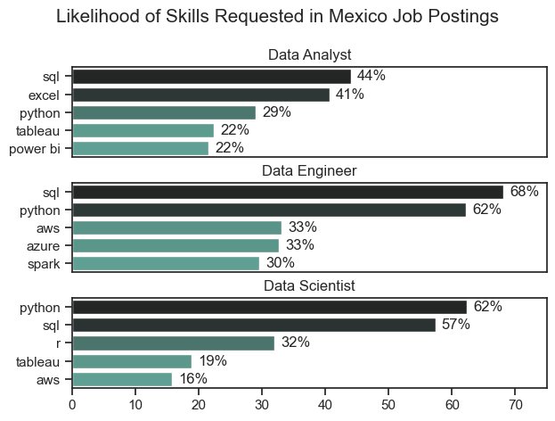
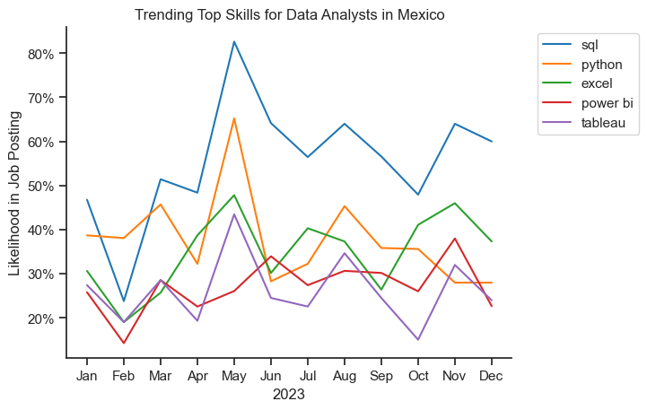
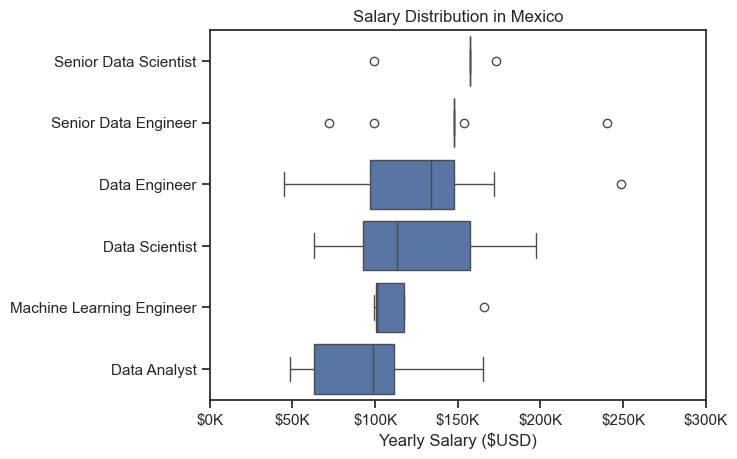
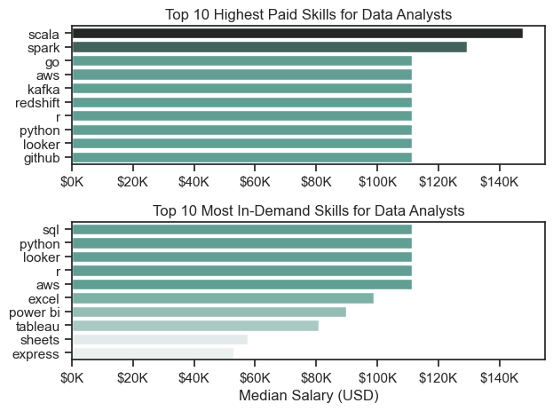

# Overview
Welcome to my analysis of the data job market, focusing on data analyst roles in Mexico. This project was created out of a desire to navigate and understand the job market more effectively and putting into action python skills. It delves into the top-paying and in-demand skills to help find optimal job opportunities for data analysts.

The data sourced from [Luke Barousse's Python Course](https://www.lukebarousse.com/python) which provides a foundation for my analysis, containing detailed information on job titles, salaries, locations, and essential skills. Through a series of Python scripts, I explore key questions such as the most demanded skills, salary trends, and the intersection of demand and salary in data analytics.

# The Questions
I will answer the following questions in my project:
1. What are the skills most in demand for the top 3 most popular data roles?
2. How are in-demand skills trending for Data Analysts?
3. How well do jobs and skills pay for Data Analysts?
4. What are the optimal skills for data analysts to learn? (High Demand AND High Paying)

# Tools Used In This Project

For my deep dive into the data analyst job market, I put into practice several key tools:

- **Python**: The backbone of my analysis, allowing me to analyze the data and find critical insights. I also used the following Python libraries:
    
    - **Pandas Library**: This was used to analyze the data.
    - **Matplotlib Library**: Used to visualize the data.
    - **Seaborn Library**: Helped create more advanced visuals.
- **Jupyter Notebooks**: The tool used to run my Python scripts which let me easily include my notes and analysis.
- **Visual Studio Code**: My go-to for executing my Python scripts.
- **Git & GitHub**: Essential for version control and sharing my Python code and analysis, ensuring collaboration and project tracking.

# Data Preparation and Clean Up
This section outlines the steps taken to prepare the data for analysis, ensuring accuracy and usability.

## Import & Clean Up Data

Starting by importing the necessary libraries and loading the dataset, followed by initial data cleaning tasks to ensure data quality.

```python
# Import Libraries
import ast
import pandas as pd
import seaborn as sns
from datasets import load_dataset
import matplotlib.pyplot as plt

# Loading Data
dataset = load_dataset('lukebarousse/data_jobs')
df = dataset['train'].to_pandas()

# Data Cleanup
df['job_posted_date'] = pd.to_datetime(df['job_posted_date'])
df['job_skills'] = df['job_skills'].apply(lambda x: ast.literal_eval(x) if pd.notna(x) else x)
```

## Filter for Mexico Jobs

To focus my analysis in the Mexico job market, I applied filters to the dataset, narrowing down to roles based in Mexico 

```python
df_MX = df[df['job_country'] == 'Mexico']
```

# The Analysis

## 1. What are the most demanded skills for the top 3 most popular data roles?

To find the most demanded skills for the top 3 most popular data roles: I filtered out those positions by which ones were the most popular, then got the top 5 skills for these top 3 roles. This query highlights the most popular job titles and their top skills, showing which skills I should pay attention to depending on the role I'm targeting.

View my notebook with detailed steps here: [2_Skill_Demand.ipynb](3_Project\2_Skills_Count.ipynb)

### Visualize Data

```python
fig, ax = plt.subplots(len(job_titles), 1)

for i, job_title in enumerate(job_titles):
    df_plot = df_skills_count[df_skills_count['job_title_short'] == job_title].head(5)
    df_plot.plot(kind='barh', x='job_skills', y='skill_count', ax=ax[i], title=job_title)
    ax[i].invert_yaxis()
    ax[i].set_ylabel('')
    ax[i].legend().set_visible(False)

fig.suptitle('Counts of Top Skills in Job Postings', fontsize=15)
fig.tight_layout()
plt.show()
```

### Results



### Insights

- `Python` appears on the top 3 data roles in Mexico, proving to be a versatile skill and highly demanded across these roles. However it's more prominent for Data Engineers (62%) and Data Scientists (62%).
- `SQL` is the most requested skill for Data Analysts (44%) and Data Engineers (68%), coming in second for Data Scientist with 57% of demand. `Python` is the most sought-after skill for Data Scientists, making an appearence in 62% of job postings.
- Data Engineers require more specialized technical skills such as `AWS`, `Azure`, and `Spark` compared to Data Analysts and Data Scientists who are expected to be proficient in more general data management and analysis tools such as `Excel`, and `Tableau`.

## 2. How are in-demand skills trending for Data Analysts?
To find how skills are trending in 2023 for Data Analysts in Mexico, first I filtered the Data Analyst positions, then grouped the skills by the month of the job posting. This resulted in the top 5 skills of data analysts by month, showing their popularity throughout 2023.

View my notebook with detailed steps here: [3_Skills_Trend.ipynb](3_Project\3_Skills_Trend.ipynb)

### Visualize Data

```python
from matplotlib.ticker import PercentFormatter

df_plot = df_DA_MX_percent.iloc[:, :5]
sns.lineplot(data=df_plot, dashes=False, legend='full' palette='tab10')
ax = plt.gca()
ax.yaxis.set_major_formatter(PercentFormatter(decimals=0))

plt.show()
```

### Results


*Bar graph visualizing the trending top skills for data analysts in Mexico in 2023.*

### Insights:
- `SQL` remains at the top of the most demanded skills consistently through the better part of the year 2023, with the exception of February, where `Python` surpassed its demand.
- `Excel` experienced a significant increase starting around September, surpassing both `Python` and `Power BI` by the end of the year.
- `Python` starts as the second most demanded skill in the year, having its demand peak during August and experiencing a decrease in June and October until the end of the year, however it stayed in second place for more than half of the year.
- There are some peaks in the demand during May involving all the top skills (`SQL`, `Python`, `Excel`, `Power BI` and `Tableau`), followed by a decrease in June and July, and picking up again in August, with `SQL` still in the lead of the most demanded skills.

## 3. How well do jobs and skills pay for Data Analysts?

### Salary Analysis for Data Jobs
To identify the highest paying roles and skills, first I filtered for jobs in Mexico and looked at their median salary. Looking at the salary distributions of common data jobs like Data Scientist, Data Engineer, and Data Analyst, to get the overall idea of which jobs are paid the most.

View my notebook with detailed steps here: [4_Salary_Analysis.ipynb](3_Project\4_Salary_Analysis.ipynb)

#### Visualize Data

```python
sns.boxplot(data=df_MX_top6, x='salary_year_avg', y='job_title_short', order=job_order)

ax = plt.gca()
ax.xaxis.set_major_formatter(plt.FuncFormatter(lambda x, pos: f'${int(x/1000)}K'))
plt.show()
```

#### Results

*Box plot visualizing the salart distributions for the top 6 data job titles.*

#### Insights
- There's a significant variation in salary ranges across different job titles. Senior Data Scientist positions tend to have the highest salary potention, with up to $157K, indicating the high value placed on advanced data skills and experience in the industry.
- Senior Data Engineer and Data Engineer roles show outliers on the higher end of the salary spectrum, suggesting that exceptional skills or circumstances can lead to high pay in these roles. In contrast, Data Analyst roles demonstrate more consistency in salary, with no outliers.
- The median salaries increase with the seniority and specialization of the roles. Senior roles (Senior Data Scientist, Senior Data Engineer) not only have higher median salaries but also larger differences in typical salaries, reflecting greater variance in compensation as responsibilities increase.

### Highest Paid & Most Demanded Skills for Data 
Next up, I narrowed the search to focus on data analysts roles, to look at the highest paid skills and the most in-demand skills.

#### Visualize Data

```python
# Top 10 Highest Paid Skills for Data Analysts
sns.barplot(data=df_DA_top_pay, x='median', y=df_DA_top_pay.index, ax=ax[0], hue='median', palette='dark:#5A9_r')

# Top 10 Most In-Demand Skills for Data Analysts
sns.barplot(data=df_DA_skills, x='median', y=df_DA_skills.index, ax=ax[1], hue='median', palette='light:#5A9')

plt.show()
```

#### Results
Here's the breakdown of the highest-paying & most in-demand skills in Mexico:


*Two separate bar graphs visualizing the highest paid skills and most in-demand skills for data analysts in Mexico.*

#### Insights
- The top graph of the Highest Paid Skills, shows that specialized technical skills like `Scala`, `Spark` and `Go` are associated with higher salaries, some reaching up to $140K, suggesting that advanced technical proficiency can increase earning potential.
- The bottom graph highlights that foundational skills like `Excel`, `Tableau`, and `Power BI` are the most in-demand, followed by `Python` and `SQL`, even though they may not offer the highest salaries. This demonstrates the importance of these core skills for employability in data analysis roles.
- There's a clear distinction between the skills that are highest paid and those that are most in-demand. Data analysts aiming to maximize their career potential should consider developing a diverse skill set that includes both high-paying specialized skills and widely demanded foundational skills.

## 4. What is the most optimal skill to learn for Data Analysts?
To identify the most optimal skills to learn (higher-paid and highest in demand), I calculated the percentage of skill demand and the median salary of these skills.

View my notebook with detailed steps here: [5_Optimal_Skills](3_Project\5_Optimal_Skills.ipynb)

### Visualize Data

```python
from adjustText import adjust_text
import matplotlib.pyplot as plt

plt.scatter(df_DA_skills_high_demand['skill_percet'], df_DA_skills_high_demand['median_salary'])
plt.show()
```

### Results

*A scatter plot visualizing the most optimal skills (high paying & high demand) for data analysts in Mexico*

### Insights
1. The scatter plot shows that most of the `programming` skills (colored orange) tend to cluster at higher salaries compared to other categories, telling us that programming expertise might offer greater salary benefits within the data analytics field, while also including `libraries` like `Spark`.
2. Analysts tools (colored blue), such as `Excel`, `Power BI`, `Tableau`, are prevailing in job postings and offer competitive salaries, showing that visualization and data analysis software are crucial for current data roles. This category not only has good salaries but is also versatile across different types of data tasks.
3. `R`, `Python` and `SQL` are programming skills with higher salaries while also being very common in job listings, indicating that proficiency in these tools can lead to good opportunities in data analytics.

# What I learned
During this project, I deepened my understanding of the data analyst job market in Mexico and improved my technical skills in Python, especially in data manipulation and visualization. Important things I've learned:

- **Advanced Python Usage**: With libraries like Pandas for data manipulation, Seaborn and Matplotlib for data visualization, and other libraries, I was able to perform complex data analysis tasks more efficiently.
- **Data Cleaning Importance**: Before any analysis can be conducted, thorough data cleaning and preparation are crucial steps to ensure accurate insights derived from the data.
- **Strategic Skills Analysis**: The project taught me the importance of aligning one's skills with market demand. Understanding the relationship between skill demand, salary and job availability allows for more strategic career planning in the tech industry.

# Insights
The overall insights that resulted from this project into the data job market for analysts are as follows:

- **Skill Demand and Salary Correlation**: There is clear correlation between the demand for specific skills and the salaries these skills command. Advanced and specialized skills like Scala and Spark often lead to higher salaries.

- **Market Trends**: There are changing trends in skill demand, highlighting the dynamic nature of the data job market. Keeping up with these trends is essential for career growth in data analytics.

- **Economic value of skills**: Understanding which skills are both in-demand and higher-paid can guide data analysts in prioritizing learning to maximize their economic returns.

# Conclusion
The exploration done into the data analyst job market has been enlighting, learning about the critical skills and trends that shape this ever evolving field. The insights I got improved my understanding and provided guidance for anyone looking to advance their career in data analytics. As the market continues to change, ongoing analysis will be essential to not only keep up but to stay ahead in data analytics. This project is a good baseline for future explorations and highlights the importance of continuous learning and adaptation in the data field.